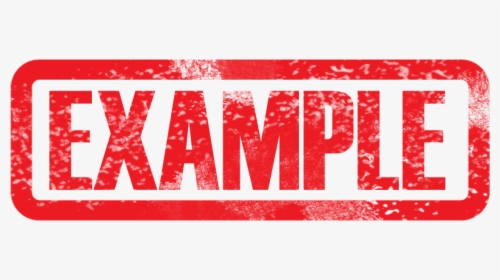

# Project TBD
by First Student Name and Second Student Name
for CS 102 Section C Fall 2021

## Introduction
What is this project for?

What does it do?

## Technical Description

Describe your project's source code in terms of algorithms and data structures.

## Screen Shots of Working Program

Add images here like this:

## Link to YouTube video recording of presentation and code walk through.

