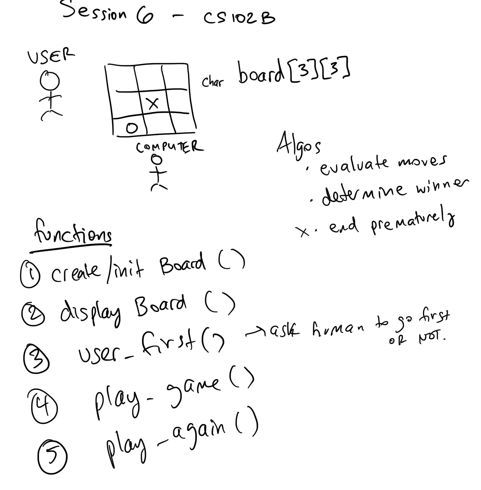

# Session 6: Putting our C skills to use...

## Topics to cover
1. Quiz 2 - full review of C basics
2. Quiz 2 review, including Fibonacci
3. Introduction of the concept of **recursion**
4. Initial tic-tac-toe design basics



See code in ```src``` directory
