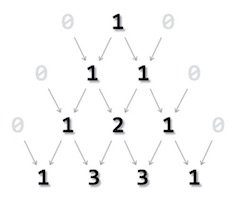

# Pascal's Triangle in C


## The Algorithm for Pascal's Triangle
```
START
  Step  1 - Take number of rows to be printed, n.
  Step  2 - Make outer iteration I for n times to print rows
  Step  3 - Make inner iteration for j to (n - 1)
  Step  4 - Print single blank space " "
  Step  5 - Close inner loop
  Step  6 - Make inner iteration for j to i
  Step  7 - Print nCr of i and j (remember formula for nCr, includes factorial)
  Step  8 - Close inner loop
  Step  9 - Print \n character after each inner iteration
  Step 10 - Return
STOP
```

## Pseudocode
```
function pascals_triangle {

   FOR i = 0 to n DO
      FOR j = 0 to n-1 DO
         PRINT " "
      END FOR

      FOR j = 0 to i DO
         PRINT nCr(i,j)
      END FOR

      PRINT \n
   END FOR

}
```

## The Code
```c
#include <stdio.h>
#define SUCCESS 0

int factorial(int n) {
   int f;
   
   for(f = 1; n > 1; n--)
      f *= n;
      
   return f;
}

int nCr(int n,int r) {
   return factorial(n) / ( factorial(n-r) * factorial(r) );
}

int main() {
   int n, i, j;

   n = 5;

   printf("Pascal's Triangle for %d levels:\n", n+1);
  
   for(i = 0; i <= n; i++) {
      for(j = 0; j <= n-i; j++)
         printf("  ");
         
      for(j = 0; j <= i; j++)
         printf(" %3d", nCr(i, j));

      printf("\n");
   }
   printf("\n");
   
   return SUCCESS;
}
```

# References
* [Tutorials Point - Pascal's Triangle in C](https://www.tutorialspoint.com/learn_c_by_examples/pascals_triangle_program_in_c.htm)

